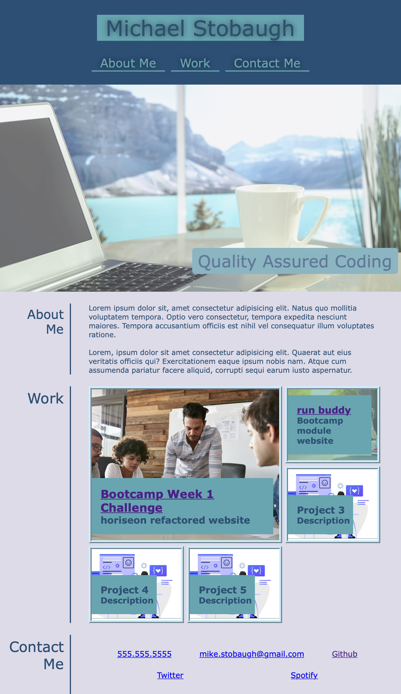

# My First Professional Portfolio
## UCLA Web Development Bootcamp Weekly Challenge Week 2

## Table of Contents

1. [Challenge Description](#challenge-description)

2. [Website Screen Shot](#website-screen-shot)

3. [Link to Live Deployment](#link-to-live-deployment)

4. [Link to Challenge Github Repository](#link-to-challenge-github-repository)

*  ## **Challenge Description**

Week 2 project from UCLA web development bootcamp course.  Build website from scratch to crate a professional portfolio. 

*  ## **Website Screen Shot**

*  ## **Link to Live Deployment**
[Link to Live Deployment](https://soft-devel.github.io/ "Portfolio Link")

* ## **Link to Challenge Github Repository**
[Link to Challenge Github Repository](https://github.com/Soft-Devel/Soft-Devel.github.io "Repository Link")